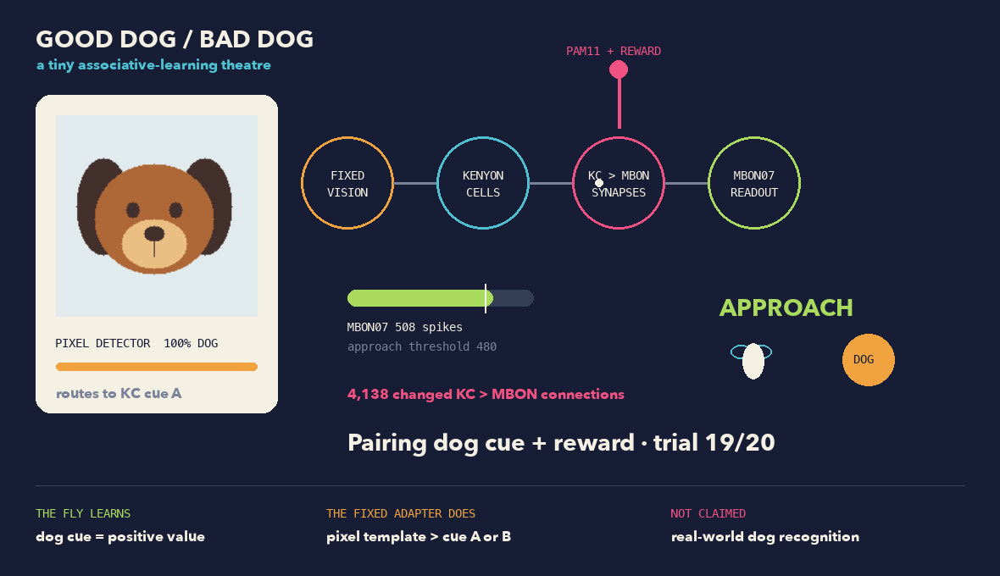

# FastConnectome

**Run connectomes as agents.**

FastConnectome is an experimental Python library for running a connectome as a
stateful agent. It keeps sensory encoding, neural dynamics, action decoding,
reinforcement, and execution backends separate so each assumption can be
inspected or replaced.

The first supported model runs the complete MaleCNS v1.0 graph: 166,700
neurons, 25,582,938 directed edges, and 124,177,617 synaptic contacts. The
simulator does not prune the graph for faster examples.

> [!IMPORTANT]
> FastConnectome is research software. MaleCNS supplies anatomy, not measured
> dynamics for every neuron or a validated learning rule. The included
> `stonkfly-v1` dynamics and KC→MBON plasticity are modeling assumptions.

## Try the dog conditioning demo

The shortest useful demo pairs a synthetic dog cue with positive reinforcement,
then tests a new dog drawing and a cat control. It opens an animation of the
pixel detector, Kenyon cells, changing KC→MBON connections, MBON07 activity, and
the resulting approach or avoidance response.



Python 3.11 and a C++17 compiler are required. On macOS, the Metal backend also
requires the Swift compiler supplied by Apple developer tools.

```sh
uv sync --all-extras
uv run fastconnectome prepare malecns-v1 --data-dir data
uv run python examples/learn_dogs.py --data-dir data
```

Preparing MaleCNS downloads about 1.1 GB and needs several additional GB while
building the graph. If you prepared it elsewhere, pass that directory to
`--data-dir`. It must contain `graph.npz` and `annotations.feather`.

A typical run produces this behavior:

```text
before training   dog cue   212 MBON07 spikes   avoid
after training    dog cue   506 MBON07 spikes   approach
control           cat cue   443 MBON07 spikes   avoid
```

The values vary slightly between CPU and Metal. The fixed decision boundary is
480 MBON07 spikes.

The dog demo separates image recognition from associative learning:

| Part | What it does |
| --- | --- |
| `TemplateDogVision` | Compares synthetic foreground pixels with fixed dog and cat templates. |
| `KCCue.A` / `KCCue.B` | Routes the detector result to `KCab-m` or `KCab-s`. |
| `DopamineValence` | Converts positive reward into a PAM11 current pulse. |
| KC→MBON plasticity | Changes existing synapses while the dog cue and PAM11 are active. |
| `MBONApproach` | Applies the fixed 480-spike approach threshold. |

Dog classification comes from the fixed template matcher. KC→MBON plasticity
learns the value of its output cue. The connectome does not learn visual
features or recognize photographs of dogs.

Use `--no-animation` for terminal output:

```sh
uv run python examples/learn_dogs.py --no-animation --data-dir data
```

## Python quickstart

The same conditioning experiment fits in one agent loop:

```python
from fastconnectome import Agent, KCCue

with Agent.from_preset(
    "malecns-kc-conditioning",
    data_dir="data",
) as fly:
    for _ in range(20):
        fly.reset(keep_learning=True)
        fly.step(KCCue.A, reward=1.0)

    fly.export_policy("models/conditioned.fcmodel")

with Agent.load_policy(
    "models/conditioned.fcmodel",
    data_dir="data",
    preset="malecns-kc-conditioning",
) as deployed:
    dog_response = deployed.step(KCCue.A)
    deployed.reset()
    control_response = deployed.step(KCCue.B)

print(dog_response.action)      # approach
print(control_response.action)  # avoid
```

`reset(keep_learning=True)` clears neural activity and short-lived state between
trials while retaining learned weights. `load_policy()` creates a fresh
simulator with plasticity disabled.

The default reinforcement adapter uses reward sign, not magnitude. A positive
value above the deadband stimulates PAM11, a negative value stimulates PPL101,
and zero schedules no pulse.

## Presets

| Preset | Observation | Action | Neural time per step | Readout |
| --- | --- | --- | ---: | --- |
| `malecns-kc-conditioning` | `KCCue` | `approach` / `avoid` | 1,000 ms | MBON07 spike count |
| `malecns-visual-turning` | RGB `uint8` frame | `left` / `right` / `hold` | 20 ms | DNp20 activity over 200 ms |

Both presets use MaleCNS v1.0, `stonkfly-v1` dynamics, and the same candidate
dopamine-gated KC→MBON rule. `backend="auto"` selects Metal when available and
uses CPU otherwise.

The visual turning preset follows an environment loop:

```python
from fastconnectome import Agent

with Agent.from_preset(
    "malecns-visual-turning",
    data_dir="data",
) as fly:
    frame = environment.reset()
    reward = 0.0

    while running:
        result = fly.step(frame, reward=reward)
        transition = environment.step(result.action)
        frame = transition.observation
        reward = transition.reward
```

Here, `reward` describes the outcome of the previous action. The runner passes
that reward into the next neural step.

## Compose an agent

Presets are ordinary `Agent` instances. Build one from individual components
when you need different populations, timing, or adapters:

```python
from fastconnectome import Agent
from fastconnectome.models.malecns import (
    BilateralTurn,
    CompoundEye,
    DopamineValence,
    MaleCNS,
)

fly = Agent(
    simulator=MaleCNS("data", learning=True),
    observation=CompoundEye(),
    action=BilateralTurn(
        cell_type="DNp20",
        window_ms=200,
        deadband_hz=2,
    ),
    reinforcement=DopamineValence(
        positive="PAM11",
        negative="PPL101",
        duration_ms=50,
        current=20,
    ),
    neural_ms=20,
)
```

The four public roles have narrow interfaces:

| Role | Contract |
| --- | --- |
| `ObservationEncoder` | Environment observation → simulator stimulus |
| `Simulator` | Stimulus and reinforcement → neural activity |
| `ActionDecoder` | Neural activity → environment action |
| `ReinforcementEncoder` | Numeric reward → simulator reinforcement |

Connectome dynamics belong to the simulator. Device-specific execution belongs
to the backend. Selecting Metal does not select a different neural model.

## Checkpoints and policies

FastConnectome keeps resumable training state separate from deployable learned
weights.

| Artifact | Contents | Use |
| --- | --- | --- |
| `.fccheckpoint` | Neural state, plasticity traces, pending dopamine, learned weights, and decoder history | Resume the same training process |
| `.fcmodel` | Learned KC→MBON weight overlay and configuration manifest | Load a fresh frozen policy |

Save or restore one agent:

```python
fly.save("runs/agent.fccheckpoint")
fly.restore("runs/agent.fccheckpoint")
```

For exact synchronous replay, checkpoint the environment and pending reward as
part of a `TrainingSession`:

```python
from fastconnectome import TrainingSession

session = TrainingSession(fly, environment)
session.run(500)
session.save_checkpoint("runs/training.fccheckpoint")
session.restore_checkpoint("runs/training.fccheckpoint")
```

An `.fcmodel` excludes the 25-million-edge baseline graph, so KC→MBON policies
are usually tens of KiB. Loading one validates its model, dynamics, and adapter
configuration. Resetting a deployed agent keeps the learned overlay.

Policies can move between CPU and Metal because both backends run
`stonkfly-v1`. Exact training checkpoints are backend-specific.

## Runners

`run_episode()` advances the environment and agent synchronously.
`TrainingSession` adds the environment state, pending reward, and exact replay
checkpoint. `RealtimeRunner` runs the environment at its own frequency, holds
the latest decoded action while neural computation continues, and queues
nonzero rewards.

The real-time Pong example runs its environment at 60 FPS:

```sh
uv run python examples/pong.py --data-dir data --steps 1200
```

Real-time sessions do not promise exact replay because thread scheduling can
change which observations the agent sees.

## Examples

| Command | Purpose |
| --- | --- |
| `uv run python examples/learn_dogs.py --data-dir data` | Animated synthetic dog conditioning |
| `uv run python examples/quickstart_kc_mbon.py --data-dir data` | Smallest preset, policy export, and frozen reload |
| `uv run python examples/learn_kc_mbon.py --data-dir data` | Counterbalanced cue, no-reward, frozen-plasticity, and memory-erasure controls |
| `uv run python examples/train_pong.py --data-dir data` | Native KC→MBON Pong experiment with exact checkpoint replay |
| `uv run python examples/learn_pong_readout.py --data-dir data` | External learned-readout positive control over frozen connectome activity |
| `uv run python examples/pong.py --data-dir data --steps 1200` | Real-time visual turning without a learned readout |

The native Pong experiment changes thousands of KC→MBON connections but has not
improved held-out behavior. The learned-readout example succeeds because its
external policy receives action-specific credit; the connectome remains frozen.
These examples report behavior separately from changed synapses.

## Backends and numerical fidelity

Choose a backend without changing dynamics:

```python
fly = Agent.from_preset(
    "malecns-visual-turning",
    data_dir="data",
    dynamics="stonkfly-v1",
    backend="cpu",
)
```

| Backend | Support | Implementation |
| --- | --- | --- |
| `cpu` | Python 3.11 host with a C++17 compiler | Stonkfly native CPU kernel |
| `metal` | macOS, Metal device, and Apple developer tools | Metal spike propagation with NumPy plasticity state |
| `auto` | Default | Metal when available, CPU otherwise |

### Performance

On a 16-core Apple M4 Max with 128 GB of memory, Metal cut neural compute time
from 31.3 ms to 4.0 ms and full `Agent.step()` time from 33.1 ms to 5.8 ms:

| Mean time per 20 ms neural step | CPU | Metal | Speedup |
| --- | ---: | ---: | ---: |
| Neural compute | 31.3 ms | 4.0 ms | 7.9× |
| Full `Agent.step()` | 33.1 ms | 5.8 ms | 5.7× |

The benchmark used 12 changing 120×200 RGB frames, learning enabled, and one
reward pulse. It excluded the first Metal step for pipeline warm-up. Both
backends produced 115,114 spikes over the run. Timings will vary with hardware
and neural activity.

The Metal backend propagates spikes on the GPU. Double-precision rate,
eligibility, memory, and plasticity updates remain in NumPy. CPU and Metal use
different floating-point accumulation orders, so long trajectories may cross
individual spike thresholds at different times. The conformance tests require
matching readouts and bounded state differences, not bit-identical execution.

`neural_ms`, decoder `window_ms`, and reinforcement `duration_ms` all refer to
simulated time. None of them promises wall-clock latency.

## Scientific scope

FastConnectome constrains simulation and plasticity to the published wiring, but
the wiring diagram does not specify a complete fly model. Current assumptions
include:

- DOOMFLY-derived neuron and synapse equations from Stonkfly
- engineered retinal projection and direct KC population cues
- inferred transmitter signs
- fixed PAM11 and PPL101 reinforcement currents
- a centered, dopamine-gated KC→MBON plasticity rule
- DNp20 and MBON07 action decoders chosen for these experiments

The full control suite in `learn_kc_mbon.py` checks cue-specific behavior after
training, retention in a fresh frozen simulator, loss after memory erasure, and
counterbalanced cues. Direct KC current makes these mechanism assays. They do
not establish natural sensory conditioning or embodied motor learning.

Endogenous modeled dopamine can change weights without imposed reward. The
no-reward control in `learn_kc_mbon.py` measures that drift and checks that it
does not cross the fixed behavioral threshold. Synaptic change alone is not
counted as behavioral learning.

A coarser graph, pruned graph, or changed equation set should use a different
dynamics identifier. FastConnectome does not hide those changes behind a speed
flag.

## Data and attribution

- [MaleCNS v1.0](https://male-cns.janelia.org/) provides the connectome under CC
  BY 4.0 terms. FastConnectome downloads the data separately.
- [nftechie/stonkfly](https://github.com/nftechie/stonkfly) provides the current
  MaleCNS loader and CPU dynamics. FastConnectome pins commit
  `78ef3e05ab0fa086032098558d893667068944a0`.
- Stonkfly's DOOMFLY-derived neural code is MIT licensed.

## Development

```sh
uv sync --all-extras
uv run pytest -q
uv run ty check
uv build
```

Tests that execute the prepared MaleCNS graph use
`FASTCONNECTOME_MALECNS_DATA`. Metal tests also require a compatible macOS host:

```sh
FASTCONNECTOME_MALECNS_DATA=/path/to/data uv run pytest tests/test_metal_malecns.py -q
```

## License

This repository does not yet include a license for FastConnectome's own source
code. Until one is added, the code is not available under an open-source
license. Upstream Stonkfly code and MaleCNS data retain their own terms described
above.
